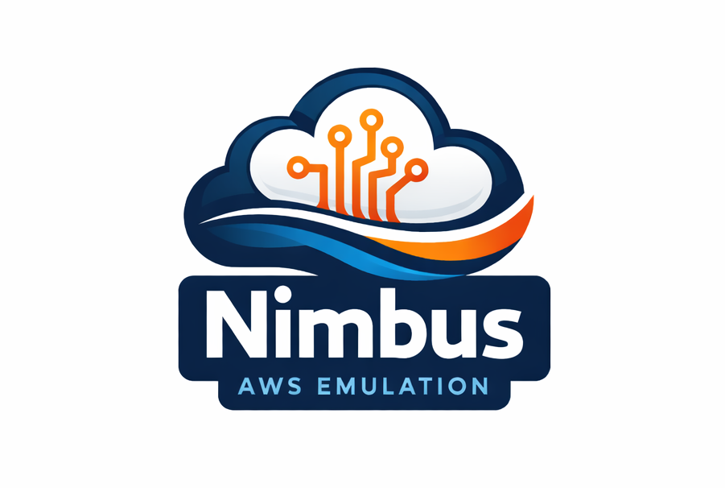

# Nimbus LocalCloud - Free AWS Services Emulator

A **complete, free AWS services emulator** for local development. Nimbus provides essential AWS functionality you need without the complexity or cost of paid alternatives.

## Why Nimbus?

**Nimbus is built for developers who want:**
- 🆓 **Free** - No subscriptions, no feature paywalls
- ⚡ **Fast** - Real AWS Lambda containers, not slow emulation
- 🎯 **Practical** - Focus on the 80% of AWS features you actually use
- 🔧 **Simple** - Docker Compose setup, works in minutes
- 🌐 **Web Console** - Built-in web interface for quick service management

### What's Supported

| Service | Features | Status |
|---------|----------|--------|
| **Lambda** | Create/update/delete/invoke, ZIP & Docker images, real runtime environment, multiple runtimes (Python, Node.js, Java, Go, Rust) | ✅ Full |
| **ECR** | Push/pull images, repositories, authentication, Docker Registry UI | ✅ Full |
| **SQS** | Standard & FIFO queues, messages, dead-letter queues, queue management | ✅ Full |
| **Event Source Mapping** | SQS → Lambda triggers, batch processing, automatic polling | ✅ Full |
| **S3** | Buckets, objects, metadata, lifecycle policies, event notifications (via MinIO) | ✅ Full |
| **DynamoDB** | Tables, items, queries, scans, indexes (via ScyllaDB Alternator) | ✅ Full |
| **Secrets Manager** | Create/retrieve/update/delete secrets, versioning, rotation | ✅ Full |
| **SSM Parameter Store** | Parameters, versions, tags, SecureString encryption, hierarchies | ✅ Full |
| **CloudWatch Logs** | Log groups, log streams, log events, filtering, retention | ✅ Full |

### Comparison with Alternatives

| Feature | Nimbus | LocalStack Free | LocalStack Pro |
|---------|--------|-----------------|----------------|
| Lambda (ZIP) | ✅ | ✅ | ✅ |
| Lambda (ECR/Docker) | ✅ | ❌ | ✅ |
| Real Lambda runtime | ✅ | ❌ | ✅ |
| SQS + Lambda triggers | ✅ | ⚠️ Limited | ✅ |
| S3 (full operations) | ✅ | ✅ | ✅ |
| DynamoDB (full operations) | ✅ | ✅ | ✅ |
| ECR | ✅ | ❌ | ✅ |
| Secrets Manager | ✅ | ⚠️ Basic | ✅ |
| SSM Parameter Store | ✅ | ⚠️ Basic | ✅ |
| CloudWatch Logs | ✅ | ⚠️ Basic | ✅ |
| Web Console | ✅ | ❌ | ✅ |
| Cost | **Free** | Free | **$$$** |

## Quick Start

### Prerequisites
- Docker & Docker Compose
- AWS CLI

### 1. Start Nimbus

Create the docker network:
```bash
docker network create localcloud
```

Start all services:
```bash
docker compose up -d
```

That's it! Services are now running:
- **API Endpoint**: `http://localhost:4566`
- **Web Console**: `http://localhost:4566/console`
- **ECR Registry**: `localhost:5000`

### 2. Configure AWS CLI

Create a profile for Nimbus:

```bash
# Option 1: Interactive
aws configure --profile nimbus
# AWS Access Key ID: localcloud
# AWS Secret Access Key: localcloud
# Default region: ap-southeast-2
# Default output format: json

# Option 2: Direct config
cat <<EOF >> ~/.aws/credentials
[nimbus]
aws_access_key_id = localcloud
aws_secret_access_key = localcloud
EOF

cat <<EOF >> ~/.aws/config
[profile nimbus]
region = ap-southeast-2
output = json
endpoint_url = http://localhost:4566
EOF
```

### 3. Set your profile

```bash
export AWS_PROFILE=nimbus
```

### 4. Test it works

```bash
# Create a simple Lambda function
cat > lambda_function.py << 'EOF'
def handler(event, context):
    return {'statusCode': 200, 'body': 'Hello from Nimbus!'}
EOF

zip function.zip lambda_function.py

aws lambda create-function \
  --function-name hello-nimbus \
  --runtime python3.11 \
  --handler lambda_function.handler \
  --zip-file fileb://function.zip \
  --role arn:aws:iam::000000000000:role/lambda-role

# Invoke it
aws lambda invoke \
  --function-name hello-nimbus \
  --payload '{"name": "World"}' \
  --cli-binary-format raw-in-base64-out \
  response.json

cat response.json
```

> Output
```json
{"statusCode": 200, "body": "Hello from Nimbus!"}
```

## Supported Runtimes

Nimbus supports all major AWS Lambda runtimes:

| Runtime | Versions |
|---------|----------|
| **Python** | 3.10, 3.11, 3.12, 3.13, 3.14 |
| **Node.js** | 20.x, 22.x, 24.x |
| **Java** | 8.al2, 11, 17, 20, 21, 25 |
| **Go** | 1.x |
| **Custom** | provided.al2, provided.al2023 |
| **Container** | Any Docker image |

## Common Use Cases

### Lambda Functions

#### From ZIP file
```bash
# Create function
cat > lambda_function.py << 'EOF'
def handler(event, context):
    return {'statusCode': 200, 'body': 'Hello to Freedom!'}
EOF
zip function.zip lambda_function.py
aws lambda create-function \
  --function-name my-function \
  --runtime python3.11 \
  --handler lambda_function.handler \
  --zip-file fileb://function.zip \
  --role arn:aws:iam::000000000000:role/lambda-role

# Update code
aws lambda update-function-code \
  --function-name my-function \
  --zip-file fileb://function.zip

# Invoke
aws lambda invoke \
  --function-name my-function \
  --payload '{"key": "value"}' \
  --cli-binary-format raw-in-base64-out \
  response.json

# Check response
cat response.json
```
> Output
```json
{"statusCode": 200, "body": "Hello to Freedom!"}
```

#### From Docker image
```bash
# Create a simple Dockerfile with your function
cat > Dockerfile << 'EOF'
FROM public.ecr.aws/lambda/python:3.11
COPY lambda_function.py ${LAMBDA_TASK_ROOT}
CMD [ "lambda_function.handler" ]
EOF

cat > lambda_function.py << 'EOF'
def handler(event, context):
    return {'statusCode': 200, 'body': 'Hello from Docker!'}
EOF

# Build the image
docker build -t my-lambda:latest .

# Tag for local ECR
docker tag my-lambda:latest localhost:5000/my-lambda:latest

# Push to local ECR registry
docker push localhost:5000/my-lambda:latest

# Create function from your image
aws lambda create-function \
  --function-name my-container-function \
  --package-type Image \
  --code ImageUri=my-lambda:latest \
  --role arn:aws:iam::000000000000:role/lambda-role

# Invoke it
aws lambda invoke \
  --function-name my-container-function \
  --payload '{"key": "value"}' \
  --cli-binary-format raw-in-base64-out \
  response.json

cat response.json
```
> Output
```json
{"statusCode": 200, "body": "Hello from Docker!"}
```

### SQS Queues

```bash
# Create queue
queueUrl=$(aws sqs create-queue --queue-name my-queue | jq -r '.QueueUrl')

# Send message
aws sqs send-message \
  --queue-url $queueUrl \
  --message-body "Hello from SQS"

# Receive messages
aws sqs receive-message \
  --queue-url $queueUrl
```

### SQS → Lambda Triggers

```bash
# Create event source mapping
aws lambda create-event-source-mapping \
  --function-name my-function \
  --event-source-arn arn:aws:sqs:ap-southeast-2:456645664566:my-queue \
  --batch-size 10

# Messages sent to the queue will automatically trigger your Lambda
```

### Secrets Manager

```bash
# Create secret
aws secretsmanager create-secret \
  --name myapp/database/credentials \
  --secret-string '{"username":"admin","password":"secret123"}'

# Retrieve secret
aws secretsmanager get-secret-value \
  --secret-id myapp/database/credentials

# Update secret
aws secretsmanager update-secret \
  --secret-id myapp/database/credentials \
  --secret-string '{"username":"admin","password":"newsecret456"}'
```

### SSM Parameters

```bash
# Store parameter
aws ssm put-parameter \
  --name /myapp/database/password \
  --value "secret123" \
  --type SecureString

# Retrieve parameter
aws ssm get-parameter \
  --name /myapp/database/password \
  --with-decryption

# List parameters by path
aws ssm get-parameters-by-path \
  --path /myapp/database
```

### DynamoDB

```bash
# Create table
aws dynamodb create-table \
  --table-name Users \
  --attribute-definitions AttributeName=UserId,AttributeType=S \
  --key-schema AttributeName=UserId,KeyType=HASH \
  --billing-mode PAY_PER_REQUEST

# Put item
aws dynamodb put-item \
  --table-name Users \
  --item '{"UserId": {"S": "user123"}, "Name": {"S": "John Doe"}}'

# Get item
aws dynamodb get-item \
  --table-name Users \
  --key '{"UserId": {"S": "user123"}}'
```

### S3

```bash
# Create bucket
aws s3 mb s3://my-bucket

# Upload file
echo "Hello S3" > test.txt
aws s3 cp test.txt s3://my-bucket/

# List objects
aws s3 ls s3://my-bucket/

# Download file
aws s3 cp s3://my-bucket/test.txt downloaded.txt
```

### CloudWatch Logs

```bash
# View logs for a Lambda function
aws logs filter-log-events \
  --log-group-name /aws/lambda/my-function

# Create log group
aws logs create-log-group \
  --log-group-name /myapp/logs

# Put log events
aws logs put-log-events \
  --log-group-name /myapp/logs \
  --log-stream-name stream1 \
  --log-events timestamp=$(date +%s000),message="Test log message"
```

## Web Console

Access the built-in web console at `http://localhost:4566/console` to:
- View and manage Lambda functions
- Monitor SQS queues and messages
- Browse DynamoDB tables and items
- Manage Secrets Manager secrets
- View CloudWatch log streams
- Browse ECR repositories
- Manage S3 buckets and objects

The console provides a visual interface similar to the AWS Console for quick debugging and testing.

## Performance

### Lambda Cold Start
```bash
$ time aws lambda invoke --function-name my-function \
  --payload '{}' --cli-binary-format raw-in-base64-out response.json

real    0m1.223s  # First invocation (container startup)
```

### Lambda Warm Start
```bash
$ time aws lambda invoke --function-name my-function \
  --payload '{}' --cli-binary-format raw-in-base64-out response.json

real    0m1.193s  # Subsequent invocations (container reuse)
```

## Testing

Run the included test suite:

```bash
cd tests

# Run all tests
./run_all_tests.sh

# Run specific service tests
cd lambda && ./test.sh
cd sqs && ./test.sh
cd ddb && ./test.sh
```

## Debugging

```bash
# View all logs
docker compose logs -f

# View specific service
docker compose logs -f lambda
docker compose logs -f sqs
docker compose logs -f api

# View Lambda container logs
docker logs lambda-{function-name}-{instance-id}
```

## Architecture

Nimbus uses a microservices architecture with dedicated containers for each AWS service:

- **API Gateway** (`api`) - Routes requests to appropriate services, unified endpoint on port 4566
- **Lambda** (`lambda`) - Container lifecycle management, function invocations
- **ECR** (`ecr`) - Docker registry (port 5000) with web UI
- **SQS** (`sqs`) - Message queuing service
- **Event Source Mapping** (`esm`) - Manages Lambda triggers from SQS and other sources
- **DynamoDB** (`ddb`) - NoSQL database using ScyllaDB Alternator
- **S3** (`s3`) - Object storage using MinIO
- **Secrets Manager** (`secretsmanager`) - Secrets storage and versioning
- **SSM Parameter Store** - Built into API Gateway

All services communicate via Docker networking on the `localcloud` network and expose a unified API on `localhost:4566`.

## Advanced Configuration

### Environment Variables

Configure services via `docker-compose.yml`:

```yaml
environment:
  - AWS_REGION=ap-southeast-2
  - AWS_ACCOUNT_ID=456645664566
  - STORAGE_PATH=/data  # Persist data between restarts
  - LOG_LEVEL=DEBUG     # Set logging level
```

### Data Persistence

Nimbus stores data in Docker volumes and local directories:
- **Lambda functions**: `./data/lambda-functions`
- **Metadata databases**: `./data/*.db`
- **S3 objects**: `data-s3` volume (MinIO)
- **DynamoDB data**: `/docker-volumes/nimbus-ddb-data` (ScyllaDB)

### Custom Network

By default, Nimbus uses the `localcloud` network. Create it before starting:

```bash
docker network create localcloud
```

## What's Missing?

Nimbus focuses on **development workflows**, not complete production feature parity. Not included:

- ❌ IAM permissions (all operations allowed)
- ❌ VPC/networking simulation
- ❌ CloudFormation
- ❌ Step Functions
- ❌ API Gateway REST/HTTP APIs (use Lambda invoke directly)
- ❌ Some advanced DynamoDB features (transactions with TxWriteItems, provisioned throughput)
- ❌ Some advanced S3 features (versioning in progress, lifecycle policies partial)

**This is intentional.** These features add complexity that most developers don't need for local testing.

## Project Structure

```
nimbus/
├── src/
│   ├── aws-api/         # Main API gateway, SSM, routing
│   │   ├── aws_api.py   # Core API implementation
│   │   ├── console/     # Web console UI
│   │   └── ssm_parameters.py
│   ├── lambda/          # Lambda service
│   │   └── main.py
│   ├── sqs/             # SQS service
│   │   └── main.py
│   ├── event-source-mapping/  # ESM service
│   │   └── main.py
│   ├── secrets-manager/ # Secrets Manager service
│   │   └── main.py
│   ├── s3/              # S3/MinIO service
│   ├── dynamodb/        # DynamoDB/ScyllaDB
│   └── ecr/             # ECR registry
├── tests/               # Integration tests
│   ├── lambda/
│   ├── sqs/
│   ├── ddb/
│   ├── s3/
│   ├── ssm/
│   └── run_all_tests.sh
├── docker-compose.yml   # Main compose file
└── docker-files/        # Service-specific compose files
```

## Contributing

Nimbus is open source and contributions are welcome! Send a PR with unit tests.

The codebase is designed to be readable and modular:
- `src/aws-api/aws_api.py` - Main API gateway, routing, ECR, SSM
- `src/lambda/main.py` - Lambda container lifecycle and invocations
- `src/sqs/main.py` - SQS queue and message management
- `src/event-source-mapping/main.py` - Event source mapping and triggers
- `src/secrets-manager/main.py` - Secrets Manager implementation
- `src/aws-api/ssm_parameters.py` - SSM Parameter Store
- `src/aws-api/console/` - Web console frontend

## License

MIT - Use freely for any purpose.

---

**Built for developers who want simple, free AWS emulation**
